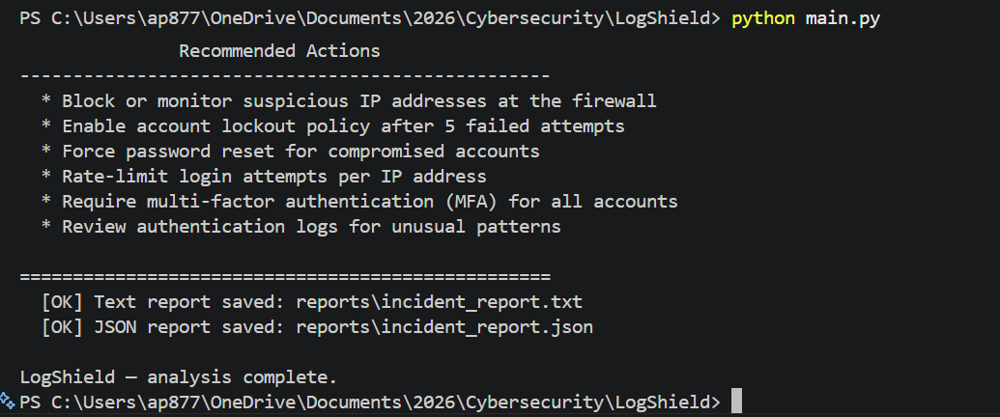
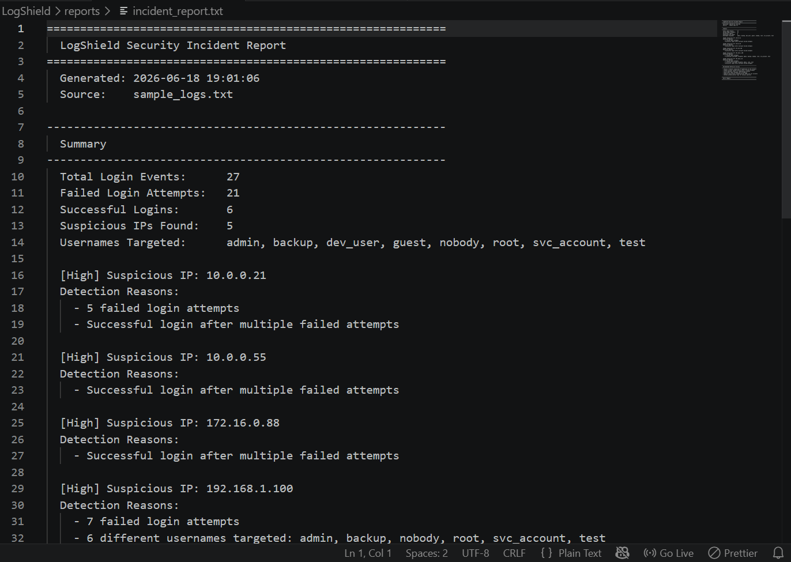
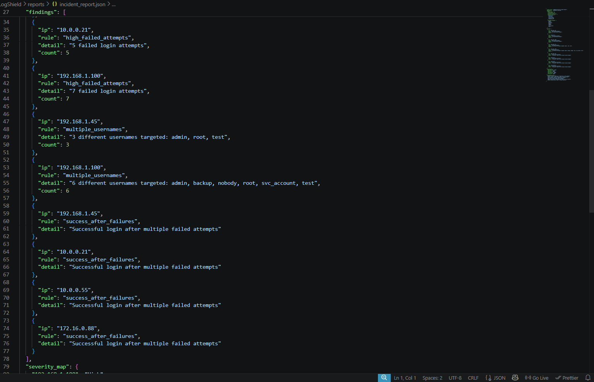

<div align="center">

# LogShield — Brute Force Detection & Log Analysis Tool

**Log analysis · threat detection · severity scoring · incident-style reporting**

[](https://python.org)
[](LICENSE)
[](https://github.com/psf/black)
[](requirements.txt)

</div>

LogShield is a defensive Python tool that analyzes authentication logs and detects suspicious login behavior. It identifies brute-force patterns, assigns severity levels, and generates incident-style reports.

> This project was built for the **IIT Kanpur B.Cyber program** portfolio. It demonstrates SOC/SIEM-style thinking, log analysis, and defensive incident response.

---

## Quick Start

```bash
git clone https://github.com/guchchi/LogShield-Brute-Force-Log-Analyzer.git
cd LogShield-Brute-Force-Log-Analyzer
python main.py
```

Zero external dependencies — Python standard library only.

---

## How It Works

```
sample_logs.txt → Parsing → Detection Rules → Severity Scoring → Incident Report
```

| Step | What Happens |
|---|---|
| 1 | Read authentication log entries from `sample_logs.txt` |
| 2 | Parse each line into timestamp, status, username, and IP |
| 3 | Run three detection rules against aggregated data |
| 4 | Assign severity per IP (Low / Medium / High) |
| 5 | Print terminal report and save text + JSON reports |

---

## Detection Rules

| Rule | Threshold | Indicates |
|---|---|---|
| Failed Login Threshold | 5+ failures from one IP | Automated brute-force attack |
| Multiple Username Attempts | 3+ usernames from one IP | Password spraying or user enumeration |
| Success After Failures | Any success following failures | Brute-force attack succeeded |

---

## Usage

```bash
python main.py
```

Reads `sample_logs.txt`, runs the detection engine, and outputs:

- Terminal summary with suspicious IPs and severity
- `reports/incident_report.txt` — human-readable incident report
- `reports/incident_report.json` — structured data for automation

---

## Screenshots

| Terminal Output | Text Report | JSON Report |
|---|---|---|
|  |  |  |

---

## Project Structure

```
LogShield/
├── main.py                # Entry point
├── detector.py            # Detection engine (parse, analyze, rules)
├── report.py              # Report generation (terminal, text, JSON)
├── sample_logs.txt        # Sample authentication logs
├── pyproject.toml         # Package metadata
├── CHANGELOG.md           # Version history
├── LICENSE                # MIT license
├── SECURITY.md            # Security policy
├── requirements.txt       # Dependencies (standard library only)
├── reports/               # Generated incident reports
├── screenshots/           # README screenshots
└── docs/
    └── PORTFOLIO_SUMMARY.md
```

---

## Cybersecurity Learning Summary

Authentication logs are one of the richest sources of security intelligence. This project taught me:

- How brute-force and password-spraying patterns appear in log data
- Why correlating events by IP and username reveals attack behavior
- How severity scoring helps prioritize incident response
- That structured reporting connects detection to action

---

## License

MIT — see [LICENSE](LICENSE).

---

<div align="center">
  <sub>Built for the IIT Kanpur B.Cyber program · Defensive cybersecurity portfolio project</sub>
</div>
